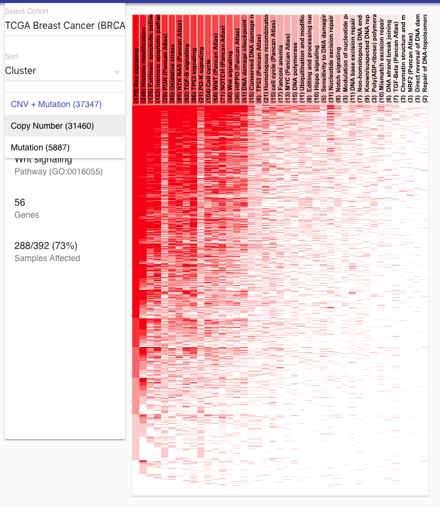
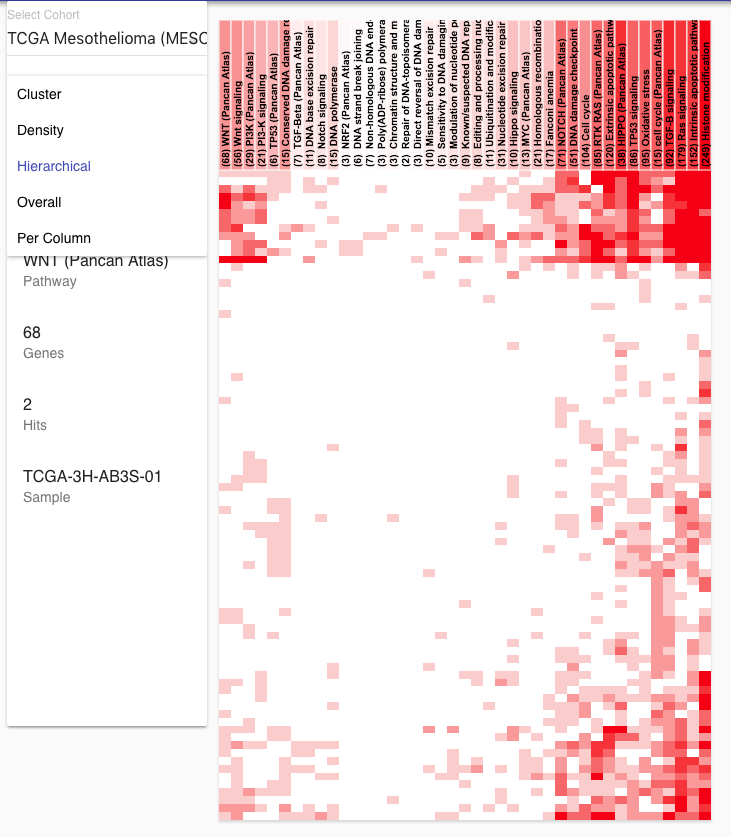

# XenaGoWidget

React widget for analyzing expression of tissue samples within a pathway or set of genes.

## To Run

   npm install
   npm start

## To Build

   npm run build

## Examples

Demo: http://xenademo.berkeleybop.io/xena/

## TODO

- add a view in Xena to new Tab #1
- put gene selection below pathway selection (and then only show the tissue view for genes) #2
- side-by-side comparison of different analysis #4 
   - provide statistics for comparisons

## Data TODO

- add cell-lines 
- add expression data 
- integration with Viper functional analysis 
- add outlier pathways 

## Possible TODO

- allow multiple selection of genes / pathways with statistics (gene enrichment)
   - provide combined statistics matches
   - (allow visible selection of fields)
   - put a control / display canvas on top of another one? 
- allow selection of multiple cohorts (displayed vertically)
- allow selection of different criteria for scoring 
- add different (drill-down) filters for scores, etc. 
- allow different ways to shade, including z-score, only percentage, etc. etc. 
- allow creation of custom pathways sets by selecting available genes (with lookup)
- allow hiding pathways
- show camplot
- show annotations for hovered / selected (are these the functional annotations?)
- integrate as new Xena page 

## Important biological questions

- what genes are involved / dominant in these pathways for 'X' affects 
- what is the combined affect of these genes on various pathways for this set of selected genes 

