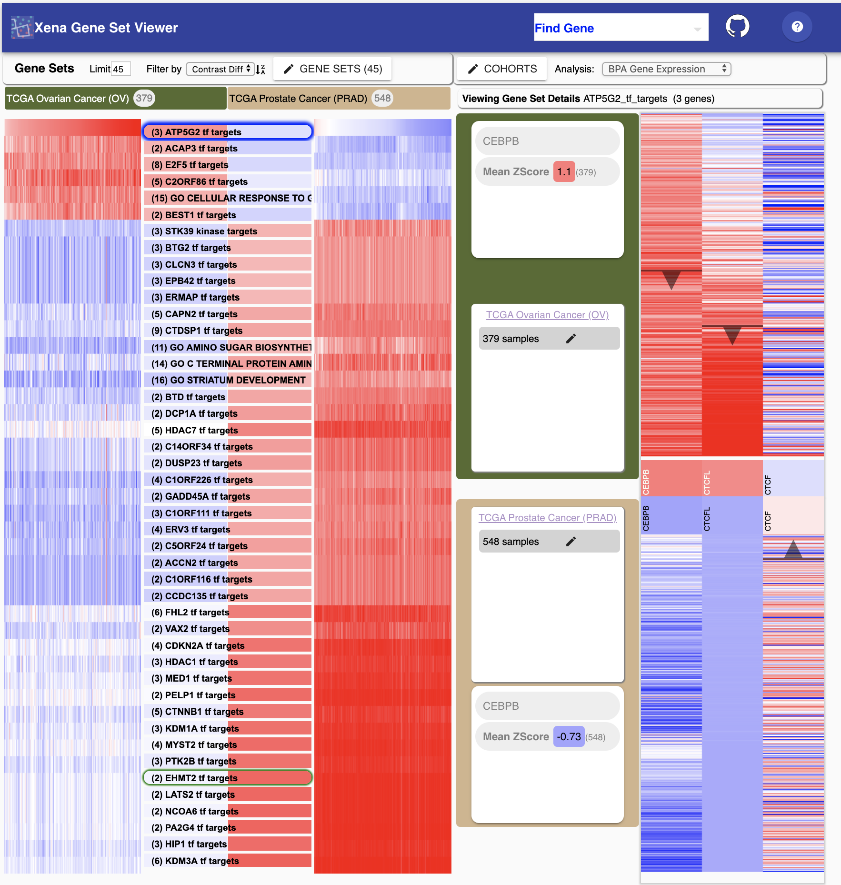

# Xena Gene Sets

React widget for analyzing expression of tissue samples within a pathway or set of genes.

[Further documentation](https://ucsc-xena.gitbook.io/project/overview-of-features/gene-sets-about)

## API / Entry points:

- Cohort selection: cohort1=<name>   cohort2=<name>, eg. cohort1=TCGA%20Stomach%20Cancer%20(STAD)
- Selected subcohorts: e.g., selectedSubCohorts1=From_Xena_Cohort1&selectedSubCohorts2=From_Xena_Cohort2&
- Analysis type: e.g., filter=BPA%20Gene%20Expression
- Selected geneset: e.g., geneset=IFI6_tf_targets
- Add sub cohorts with samples:   subCohortSamples=<cohort>:<subcohort name>:<samples>   . e.g., subCohortSamples=TCGA%20Stomach%20Cancer%20(STAD):From_Xena_Cohort1:TCGA-BR-8384-01,TCGA-BR-4371-01
- Remove sub cohorts with samples:   subCohortSamples=<cohort>:<subcohort name>:   . e.g., subCohortSamples=TCGA%20Stomach%20Cancer%20(STAD):From_Xena_Cohort1:
- Set color label fo reach cohort: e.g., cohort1Color=green, cohort2Color=blue

Example link:

http://xenademo.berkeleybop.io/xena/#cohort1=TCGA%20Stomach%20Cancer%20(STAD)&cohort2=TCGA%20Stomach%20Cancer%20(STAD)&filter=BPA%20Gene%20Expression&geneset=IFI6_tf_targets&selectedSubCohorts1=From_Xena_Cohort1&selectedSubCohorts2=From_Xena_Cohort2&subCohortSamples=TCGA%20Stomach%20Cancer%20(STAD):From_Xena_Cohort1:TCGA-BR-8384-01,TCGA-BR-4371-01&subCohortSamples=TCGA%20Stomach%20Cancer%20(STAD):From_Xena_Cohort2:TCGA-D7-6822-01,TCGA-BR-8485-01&cohort1Color=green&cohort2Color=pink

Running at https://xenagoweb.xenahubs.net/xena/

## Analysis Server Software

While not necessary, you can run your own analysis server using R using the analysis server code:

https://github.com/ucscXena/xena-analysis-grails

Its a bit complicated to set up, but requires R, Grails, and a postgresql database. 

## Instructions

    npm install

Running locally:

    npm start

Build for production:

    npm run build

Run tests:

    npm test

Lint:
  
    npm run-script lint

